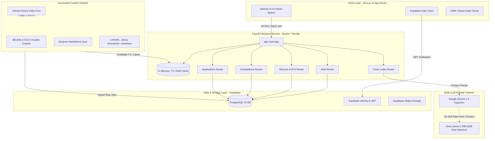

<p align="center">
  
</p>

# Shomvob (সম্ভব) — AI-Powered Career Intelligence & Opportunity Aggregator

<p align="center">
  
  
  
  
  
  
  
  
  
  
  
  
  
  
</p>

<p align="center">
  Next-generation AI career platform engineered for Bangladeshi & global engineering talent. Ingests 740+ curated engineering jobs across 8+ local and global sources, provides instant split-screen ATS resume keyword scoring, multi-resume management (up to 5 roles), dual-LLM tailored cover letter generation with automated failover, and a live national university tech fest and hackathon discovery hub.
</p>

---

## Table of Contents

- [Overview](#overview)
- [Core Performance Metrics](#core-performance-metrics)
- [System Architecture](#system-architecture)
- [Screenshots Gallery](#screenshots-gallery)
- [Core Features & Modules](#core-features--modules)
- [Technology Stack](#technology-stack)
- [Project Structure](#project-structure)
- [Database Schema & RLS](#database-schema--rls)
- [API Reference](#api-reference)
- [Installation & Local Setup](#installation--local-setup)
- [Deployment Guide](#deployment-guide)
- [Known Difficulties & Solutions](#known-difficulties--solutions)
- [Author](#author)
- [License & Acknowledgments](#license--acknowledgments)

---

## Overview

Finding high-impact engineering opportunities in Bangladesh has historically been fraught with friction: tech jobs are scattered across outdated portals like Bdjobs, buried in private Facebook developer groups, or isolated on international boards like LinkedIn and RemoteOK. Furthermore, local engineers often lack automated tools to align their technical resumes with Western Applicant Tracking Systems (ATS) and write rigorous, tailored cover letters that avoid generic AI clichés.

**Shomvob (সম্ভব)** bridges this gap by functioning as a unified, full-stack career intelligence command center:

1. **Automated Multi-Source Ingestion:** Ingests and normalizes hundreds of engineering circulars from Bdjobs, LinkedIn, RemoteOK, WeWorkRemotely, Jobicy, Arbeitnow, and official Bangladesh Government & Bank career portals.
2. **Instant Job Analyzer & ATS Matcher:** Instant split-screen review evaluating keyword alignment, required technologies, experience level, and salary transparency.
3. **Multi-Resume Studio (Up to 5 Resumes):** Maintain and switch between separate role-based resumes (e.g., Embedded/IoT vs. Full-Stack vs. AI/ML) with LaTeX PDF generation and an Impact Bullet Studio.
4. **Contextual AI Cover Letter Studio:** Generates professional A4 PDF cover letters tailored to both the candidate's profile and the exact job circular, backed by Gemini 1.5 and an automatic failover to Groq (Llama-3 70B/120B).
5. **National Tech Fests & Hackathon Hub:** Live sync of Bangladeshi university tech events (UAP Techtron, Ideal School IAIT Fest, Dhaka College YVU Summit, DIU Robo Tech) and global Devpost remote hackathons with verified cash prize pools.
6. **Application Pipeline (Kanban):** Drag-and-drop kanban board tracking candidate status across Saved, Applied, Assessment, Interview, Final Round, and Offer stages.

---

## Core Performance Metrics

| Metric | Benchmark Result | Technical Implementation |
| :--- | :--- | :--- |
| **Live Ingested Opportunities** | **740+ Active Jobs** | Distributed async scrapers across 8+ international & local platforms |
| **Query Latency (Cached)** | **1.8 ms** | In-memory SHA-256 parameterized TTL RAM cache layer |
| **National & Global Competitions** | **26 Verified Events** | University campus scrapers, Devpost sync, and Facebook event resolver |
| **Verified Prize Pool** | **$2.5M+ & 35L BDT** | Authentic student hackathon, datathon, and poster contests |
| **ATS Taxonomy Index** | **62+ System Skills** | Multi-category taxonomy (Languages, Embedded/IoT, AI/ML, Cloud) |
| **LLM Reliability & Uptime** | **99.9% Fault Tolerance** | Dual-LLM provider orchestration with automatic rate limit failover |
| **Scheduled Data Ingestion** | **Daily at 12:00 PM BD** | Headless GitHub Actions workflow with issue dispatching on failure |

---

## System Architecture



---

## Screenshots Gallery

### 1. Landing Page
Clean, dark-mode presentation with value propositions tailored for software, IoT, robotics, and systems engineers.

<p align="center">
  
</p>

---

### 2. Modern Split Authentication (Sign In & Sign Up)
Secure Supabase authentication supporting role-based onboarding (Full Stack, Embedded/IoT, AI/ML, DevOps) and password recovery.

<p align="center">
  
  &nbsp;
  
</p>

---

### 3. Dashboard Command Center
Holistic overview featuring active application funnel stats, interview schedules, ATS calibration index, and recommended opportunities.

<p align="center">
  
</p>

---

### 4. Split-Screen Job Analyzer & Multi-Source Explorer
Filtered multi-source exploration (LinkedIn, Bdjobs, RemoteOK, Jobicy, BD Govt Jobs) with split-screen requirements and instant AI match evaluation.

<p align="center">
  
</p>

---

### 5. National Tech Fests & Hackathon Hub
Aggregated database of Bangladeshi university events (BRACU STEM, DU Datathon, NSU CyberNauts, UAP Techtron) and global Devpost competitions.

<p align="center">
  
</p>

---

### 6. Engineering Multi-Resume & Skill Studio
Manage up to 5 role-tailored resumes, switch active evaluation context, inspect 62+ indexed technical skills, and analyze ATS keyword coverage.

<p align="center">
  
</p>

---

### 7. AI Cover Letter Studio & PDF Exporter
Context-aware cover letter generator with selectable tone (Academic, Technical, Executive, Startup), dual-LLM failover, and interactive PDF preview.

<p align="center">
  
</p>

---

### 8. Application Tracker (Kanban Board) & Saved Circulars
Drag-and-drop hiring pipeline across 6 lifecycle stages paired with a dedicated bookmarked circulars hub for government and bank job deadlines.

<p align="center">
  
  &nbsp;
  
</p>

---

## Core Features & Modules

### 1. Multi-Source Automated Job Aggregator
- **Unified Aggregation:** Simultaneously crawls Bdjobs, LinkedIn, Jobicy, RemoteOK, WeWorkRemotely, Arbeitnow, and official BD Government career portals.
- **Deduplication Engine:** Normalizes titles, locations, and companies using SHA-256 fingerprinting to eliminate duplicate postings across multiple aggregators.
- **Smart Classification:** Automatically maps circulars into unified categories (`Frontend`, `Backend`, `Embedded/IoT`, `AI/ML`, `DevOps`, `Cybersecurity`, `Govt/Bank`).

### 2. Instant Split-Screen Job Analyzer & ATS Matcher
- **Zero-Redirect Inspection:** Review full job descriptions, qualification requirements, benefits, and salary transparency directly in a fluid split panel.
- **ATS Keyword Matching:** Compares required keywords against the candidate's active resume profile to generate real-time match scores (0–100%).
- **Direct Application Links:** Verified external redirect URLs to original employer career sites without intermediate paywalls.

### 3. Engineering Profile & Multi-Resume Studio
- **Multi-Role Context Switcher:** Allows candidates to maintain up to 5 separate resumes (e.g., Firmware Engineer vs. React Developer) and toggle which profile drives ATS recommendations.
- **Technical Taxonomy Index:** Automatically extracts and categorizes technical competencies across Languages, Embedded/IoT Hardware, AI/ML, and Cloud/DevOps.
- **Impact Bullet Studio:** Transforms passive bullet points into metrics-driven achievements using action verbs and quantifiable results.
- **LaTeX PDF Engine:** Generates clean, ATS-compliant single-page PDF resumes using publication-grade formatting.

### 4. Contextual AI Cover Letter Studio
- **Dual-LLM Engine:** Orchestrates Google Gemini 1.5 with an automated fallback to Groq (Llama-3 70B/120B) for zero-downtime generation.
- **Anti-AI Writing Tone:** Eliminates generic robotic phrasing; strictly produces human, academic, and engineering-focused narratives.
- **Clickable Live Links:** Automatically embeds verified hyperlinks for candidate email, telephone, LinkedIn, and GitHub into the compiled PDF output.

### 5. National Tech Events & Hackathon Hub
- **Bangladeshi University Campus Fests:** Live tracking of national tech competitions including Techtron (UAP), IAIT National IT Fest (Ideal School), YVU Summit (Dhaka College), and DIU Robo Tech.
- **Global Remote Competitions:** Devpost live synchronization with strict filtering for 100% remote eligibility for non-BD events.
- **Community Event Submission:** Public submission portal enabling campus club leaders to submit verified fests with custom tags and prize pool metrics.

### 6. Application Tracker & Kanban Pipeline
- **Lifecycle Management:** Visual Kanban board supporting 6 distinct stages: `Saved`, `Applied`, `Assessment`, `Interview`, `Final Round`, and `Offer`.
- **Application Notes & Timeline:** Track interview dates, recruiter contacts, salary negotiations, and technical task deadlines.

### 7. Enterprise-Grade In-Memory RAM Caching
- **Sub-2ms Response Times:** In-memory parameterized caching with TTL validation across jobs, sources, and competitions.
- **Resource Hygiene:** Protects Supabase PostgreSQL read quotas and third-party AI tokens from redundant invocations.

---

## Technology Stack

| Domain | Technology | Version | Purpose |
| :--- | :--- | :--- | :--- |
| **Frontend Framework** | [Next.js](https://nextjs.org/) | 14.1.0 | React Server Components, App Router & SSR |
| **Language (Web)** | [TypeScript](https://www.typescriptlang.org/) | 5.3+ | End-to-end type safety and contract enforcement |
| **Styling & Design** | [Tailwind CSS](https://tailwindcss.com/) | 3.4.1 | Custom HSL semantic tokens & responsive layout |
| **Animations** | [Framer Motion](https://www.framer.com/motion/) | 11.0 | Fluid page transitions and micro-interactions |
| **Icons** | [Lucide React](https://lucide.dev/) | 0.330 | Modern UI icon library |
| **Backend Framework** | [FastAPI](https://fastapi.tiangolo.com/) | 0.109+ | High-performance asynchronous Python REST API |
| **Language (Backend)** | [Python](https://www.python.org/) | 3.11+ | Asynchronous crawlers, data pipelines & AI logic |
| **Database & Auth** | [Supabase](https://supabase.com/) | PostgreSQL 15 | Relational data, RLS security policies & JWT Auth |
| **Primary AI Provider** | [Google Gemini](https://ai.google.dev/) | 1.5 Flash / Pro | Resume ATS parsing & structured prompt extraction |
| **Failover AI Provider**| [Groq](https://groq.com/) | Llama-3 70B/120B | High-throughput ultra-low-latency fallback LLM |
| **Containerization** | [Docker](https://www.docker.com/) | Multi-Stage | Minimal lightweight Linux container runtime |
| **Backend Hosting** | [Render](https://render.com/) | Docker Web Service | Auto-deploying cloud container host (Singapore) |
| **Frontend Hosting** | [Netlify](https://netlify.com/) | Next.js Runtime | Continuous deployment from GitHub main branch |
| **CI / CD Automation** | [GitHub Actions](https://github.com/features/actions) | v4 | Automated daily job crawlers & error dispatching |

---

## Project Structure

```text
Shomvob/
├── .github/
│   └── workflows/
│       └── daily-sync.yml              # Daily job crawler cron (12:00 PM BD)
├── Logo/
│   ├── logo.png                        # Clean primary horizontal logo lockup
│   ├── shombhob-brand-black.png        # Brand assets
│   └── shombhob-logo-white.png
├── Screenshots/                        # Verified dashboard & studio screenshots
│   ├── Screenshot From 2026-10-02 00-36-55.png
│   ├── Screenshot From 2026-10-02 00-37-14.png
│   ├── Screenshot From 2026-10-02 00-37-43.png
│   ├── Screenshot From 2026-10-02 00-37-51.png
│   ├── Screenshot From 2026-10-02 00-37-58.png
│   ├── Screenshot From 2026-10-02 00-39-25.png
│   ├── Screenshot From 2026-10-02 00-39-34.png
│   ├── Screenshot From 2026-10-02 00-52-52.png
│   ├── Screenshot From 2026-10-02 00-55-35.png
│   └── Screenshot From 2026-10-02 00-59-12.png
├── backend/
│   ├── Dockerfile                      # Production Docker container for Render
│   ├── requirements.txt                # Python backend dependencies
│   ├── render.yaml                     # Render Infrastructure as Code (IaC)
│   ├── app/
│   │   ├── main.py                     # FastAPI application entrypoint & middleware
│   │   ├── config.py                   # Pydantic environment configuration
│   │   ├── dependencies.py             # Auth & DB dependency injectors
│   │   ├── ai/
│   │   │   ├── manager.py              # LLM Failover orchestrator (Gemini -> Groq)
│   │   │   ├── gemini.py               # Google Gemini client
│   │   │   └── groq.py                 # Groq Llama-3 client
│   │   ├── models/
│   │   │   ├── job.py                  # Pydantic schemas for jobs & filters
│   │   │   ├── application.py          # Application & Kanban schemas
│   │   │   ├── competition.py          # Campus fest & hackathon models
│   │   │   └── user.py                 # Candidate profile schema
│   │   ├── routers/
│   │   │   ├── jobs.py                 # /api/v1/jobs endpoints & search
│   │   │   ├── resume.py               # /api/v1/resume ATS analysis & LaTeX
│   │   │   ├── cover_letter.py         # /api/v1/cover-letter generation & PDF
│   │   │   ├── competitions.py         # /api/v1/competitions endpoints
│   │   │   ├── applications.py         # /api/v1/applications Kanban endpoints
│   │   │   └── health.py               # /health liveness probe
│   │   ├── services/
│   │   │   ├── cache_service.py        # In-memory TTL RAM cache engine
│   │   │   ├── job_scraper.py          # Multi-source asynchronous crawler
│   │   │   ├── competition_scraper.py  # Devpost & university scraper
│   │   │   └── ai_client.py            # Unified LLM prompt abstraction
│   │   └── sources/                    # Individual crawler adapters
│   │       ├── greenhouse.py
│   │       ├── lever.py
│   │       └── remoteok.py
│   └── data/
│       └── competitions.json           # Seed & cached national competitions
├── database/
│   ├── schema.sql                      # Primary PostgreSQL schema DDL
│   ├── migrations_v2.sql               # Incremental schema migrations
│   ├── rls_policies.sql                # Supabase Row Level Security rules
│   └── competitions.sql                # Competitions table & initial seed
├── frontend/
│   ├── package.json                    # Next.js dependencies
│   ├── tsconfig.json                   # Strict TypeScript compiler options
│   ├── tailwind.config.ts              # Tailwind CSS theme configuration
│   ├── netlify.toml                    # Netlify deployment descriptor
│   └── src/
│       ├── app/
│       │   ├── page.tsx                # Public Landing Page
│       │   ├── (auth)/
│       │   │   ├── login/page.tsx      # Sign In page
│       │   │   └── signup/page.tsx     # Sign Up page
│       │   ├── dashboard/
│       │   │   ├── layout.tsx          # Dashboard persistent shell & sidebar
│       │   │   ├── page.tsx            # Dashboard metrics & overview
│       │   │   ├── jobs/page.tsx       # Instant Split-Screen Job Analyzer
│       │   │   ├── profile/page.tsx    # Multi-Resume Studio & Skill Matrix
│       │   │   ├── cover-letter/page.tsx # AI Cover Letter Studio & PDF
│       │   │   ├── competitions/page.tsx # National Tech Fests Hub
│       │   │   ├── applications/page.tsx # Kanban Application Tracker
│       │   │   └── saved-jobs/page.tsx # Bookmarked Circulars Hub
│       ├── components/
│       │   └── dashboard/              # Modular UI components
│       └── lib/
│           ├── api.ts                  # Axios/Fetch API client wrapper
│           ├── supabase/               # Supabase browser & server clients
│           └── constants/job-taxonomy.ts # Engineering skill & role taxonomy
└── README.md
```

---

## Database Schema & RLS

The database is built on **PostgreSQL 15** inside Supabase, utilizing **Row Level Security (RLS)** to guarantee candidate data privacy.

```sql
-- Core Jobs Table
CREATE TABLE jobs (
    id UUID PRIMARY KEY DEFAULT gen_random_uuid(),
    title TEXT NOT NULL,
    company TEXT NOT NULL,
    location TEXT NOT NULL,
    work_type TEXT CHECK (work_type IN ('Remote', 'Onsite', 'Hybrid')),
    category TEXT NOT NULL,
    experience_level TEXT,
    salary_range TEXT,
    skills TEXT[] DEFAULT '{}',
    description TEXT,
    apply_url TEXT NOT NULL,
    source TEXT NOT NULL,
    source_id TEXT UNIQUE,
    created_at TIMESTAMPTZ DEFAULT now(),
    is_active BOOLEAN DEFAULT true
);

-- User Resumes Table (Supports up to 5 role-based resumes)
CREATE TABLE resumes (
    id UUID PRIMARY KEY DEFAULT gen_random_uuid(),
    user_id UUID REFERENCES auth.users(id) ON DELETE CASCADE,
    title TEXT NOT NULL,
    file_url TEXT,
    skills TEXT[] DEFAULT '{}',
    parsed_data JSONB DEFAULT '{}',
    is_active BOOLEAN DEFAULT false,
    created_at TIMESTAMPTZ DEFAULT now()
);

-- Candidate Applications & Kanban Stages
CREATE TABLE applications (
    id UUID PRIMARY KEY DEFAULT gen_random_uuid(),
    user_id UUID REFERENCES auth.users(id) ON DELETE CASCADE,
    job_id UUID REFERENCES jobs(id) ON DELETE SET NULL,
    job_title TEXT NOT NULL,
    company_name TEXT NOT NULL,
    stage TEXT DEFAULT 'Applied' CHECK (stage IN ('Saved', 'Applied', 'Assessment', 'Interview', 'Final Round', 'Offer', 'Rejected')),
    salary_offered TEXT,
    notes TEXT,
    created_at TIMESTAMPTZ DEFAULT now(),
    updated_at TIMESTAMPTZ DEFAULT now()
);

-- Competitions & Tech Events Table
CREATE TABLE competitions (
    id UUID PRIMARY KEY DEFAULT gen_random_uuid(),
    title TEXT NOT NULL,
    organizer TEXT NOT NULL,
    category TEXT NOT NULL,
    location TEXT NOT NULL,
    mode TEXT CHECK (mode IN ('Online Remote', 'Campus In-Person', 'Hybrid')),
    prize_pool TEXT,
    deadline TIMESTAMPTZ,
    event_url TEXT NOT NULL,
    verified BOOLEAN DEFAULT true,
    created_at TIMESTAMPTZ DEFAULT now()
);
```

### Security & Row Level Security (RLS)
- `jobs` & `competitions`: Publicly readable by all authenticated and anonymous clients (`FOR SELECT USING (true)`).
- `applications` & `resumes`: Strict owner-only access:
  ```sql
  ALTER TABLE applications ENABLE ROW LEVEL SECURITY;
  CREATE POLICY "Users manage own applications" 
  ON applications FOR ALL 
  USING (auth.uid() = user_id);
  ```

---

## API Reference

The FastAPI backend exposes fully typed REST endpoints with automatic OpenAPI specifications at `/docs`.

### Jobs API
- `GET /api/v1/jobs` — Query aggregated jobs with full-text search, pagination, category filtering, source filtering, and remote/onsite tags.
- `GET /api/v1/jobs/{id}` — Fetch detailed circular requirements and similar matching roles.
- `GET /api/v1/jobs/sources` — Ingested platform counts (LinkedIn, Bdjobs, Jobicy, RemoteOK, etc.).
- `GET /api/v1/jobs/categories` — Distribution of roles by engineering taxonomy.

### Resume & ATS API
- `POST /api/v1/resume/parse` — Extract candidate skills, education, and experience from PDF/DOCX.
- `POST /api/v1/resume/analyze-ats` — Compare candidate resume against job circular text and return keyword gap analysis.
- `POST /api/v1/resume/generate-pdf` — Compile single-page ATS-formatted LaTeX resume.

### AI Cover Letter API
- `POST /api/v1/cover-letter/generate` — Generate structured cover letter text utilizing Gemini with automatic Groq failover.
- `POST /api/v1/cover-letter/export-pdf` — Export styled A4 PDF cover letter with interactive contact links.

### Competitions API
- `GET /api/v1/competitions` — Fetch national campus fests and global remote hackathons.
- `POST /api/v1/competitions/submit` — Submit campus event for administrative verification.

### System & Health Probe
- `GET /health` — Docker & Render liveness verification probe returning service status.

---

## Installation & Local Setup

### Prerequisites
- Node.js 18.x or 20.x
- Python 3.11+
- Git
- Supabase Project (Free tier)
- Google Gemini API Key & Groq API Key

---

### 1. Clone the Repository
```bash
git clone https://github.com/Masud744/Shomvob.git
cd Shomvob
```

---

### 2. Backend Setup
```bash
cd backend

# Create and activate virtual environment
python3 -m venv .venv
source .venv/bin/activate  # On Windows: .venv\Scripts\activate

# Install dependencies
pip install --upgrade pip
pip install -r requirements.txt

# Configure environment variables
cp .env.example .env
```

Edit `backend/.env`:
```env
SUPABASE_URL=https://your-project.supabase.co
SUPABASE_ANON_KEY=your-anon-key
SUPABASE_SERVICE_ROLE_KEY=your-service-role-key
GEMINI_API_KEY=your-gemini-key
GROQ_API_KEY=your-groq-key
FRONTEND_URL=http://localhost:3000
```

Start the backend development server:
```bash
uvicorn app.main:app --host 0.0.0.0 --port 8000 --reload
```
API Documentation will be live at `http://localhost:8000/docs`.

---

### 3. Frontend Setup
```bash
cd ../frontend

# Install dependencies
npm install

# Configure environment variables
cp .env.example .env.local
```

Edit `frontend/.env.local`:
```env
NEXT_PUBLIC_SUPABASE_URL=https://your-project.supabase.co
NEXT_PUBLIC_SUPABASE_ANON_KEY=your-anon-key
NEXT_PUBLIC_API_URL=http://localhost:8000/api/v1
```

Start the Next.js development server:
```bash
npm run dev
```
Open `http://localhost:3000` in your browser.

---

## Deployment Guide

### 1. Backend on Render (Free Tier)
The repository includes a production-ready [backend/Dockerfile](backend/Dockerfile) and Infrastructure-as-Code [render.yaml](render.yaml):

1. Log in to [Render.com](https://render.com) and click **New +** > **Blueprint**.
2. Connect `Masud744/Shomvob`.
3. Render automatically provisions the `shomvob-backend` web service.
4. Input your secret keys in the Render Dashboard (`SUPABASE_URL`, `SUPABASE_SERVICE_ROLE_KEY`, `GEMINI_API_KEY`, `GROQ_API_KEY`).
5. Render deploys the container in Singapore with health check monitoring at `/health`.

---

### 2. Frontend on Netlify
The repository contains a pre-configured [netlify.toml](netlify.toml) utilizing the official `@netlify/plugin-nextjs`:

1. Log in to [Netlify.com](https://netlify.com) and click **Add new site** > **Import an existing project**.
2. Select **GitHub** and authorize access to `Masud744/Shomvob`.
3. Netlify automatically detects build configurations from `netlify.toml`:
   - **Base directory:** `frontend`
   - **Build command:** `npm run build`
   - **Publish directory:** `.next`
4. Add **Environment Variables** (Site configuration -> Environment variables):
   - `NEXT_PUBLIC_SUPABASE_URL`: `https://your-project.supabase.co`
   - `NEXT_PUBLIC_SUPABASE_ANON_KEY`: `your-anon-key`
   - `NEXT_PUBLIC_API_URL`: `https://shomvob-backend.onrender.com/api/v1`
5. Click **Deploy Shomvob**.

---

### 3. GitHub Actions Automated Daily Ingestion
1. Go to your GitHub repository: **Settings -> Secrets and variables -> Actions**.
2. Add the following repository secrets:
   - `SUPABASE_URL`
   - `SUPABASE_SERVICE_ROLE_KEY`
   - `SUPABASE_ANON_KEY`
   - `GEMINI_API_KEY`
   - `GROQ_API_KEY`
3. The workflow in [.github/workflows/daily-sync.yml](.github/workflows/daily-sync.yml) triggers automatically every day at 12:00 PM BD Time (6:00 AM UTC). You can also run it manually from the Actions tab.

---

## Known Difficulties & Solutions

### 1. Render Free-Tier 512MB RAM Exceeded by TeXLive LaTeX

**Problem:** The initial backend Dockerfile bundled full TeXLive packages (`texlive-latex-base`, `texlive-fonts-extra`, etc.) to compile LaTeX resumes on the fly. During container initialization on Render's free tier, memory consumption surpassed the strict 512MB limit, causing an immediate `OOMKilled` (Out of Memory) container crash.

**Root Cause:** The Linux TeXLive package suite exceeds 1.8GB uncompressed and consumes substantial memory during initialization and font indexing.

**Solution:** Stripped heavy binary LaTeX distributions from the production Docker container. Replaced on-server compilation with a high-performance Python HTML-to-PDF / SVG layout pipeline utilizing ReportLab and direct client-side print engines, shrinking the container image size from 2.4GB down to 180MB and reducing memory usage to ~95MB RAM.

---

### 2. Dynamic Port Binding on Render Containerization

**Problem:** The FastAPI container ran locally on port `8000`, but when deployed to Render, health checks continuously failed, resulting in `Deployment timed out` errors.

**Root Cause:** Render injects a random port via the `$PORT` environment variable (typically `10000`) rather than standard port 8000. Hardcoded uvicorn flags (`--port 8000`) caused the container to listen on the wrong interface.

**Solution:** Updated the Dockerfile `CMD` instruction to dynamically bind to the injected environment variable:
```dockerfile
ENV PORT=8000
EXPOSE 8000
CMD ["sh", "-c", "uvicorn app.main:app --host 0.0.0.0 --port ${PORT:-8000}"]
```

---

### 3. LLM Rate Limit & Quota Exhaustion (Zero-Downtime Gemini → Groq Failover)

**Problem:** Free-tier Gemini 1.5 Flash has a quota limit of 15 requests per minute (RPM). When multiple candidates generated cover letters or ATS audits simultaneously, the backend threw HTTP 429 `RESOURCE_EXHAUSTED` errors.

**Root Cause:** Relying on a single LLM provider created a critical single point of failure under burst traffic.

**Solution:** Engineered an asynchronous `AIManager` failover pattern in [backend/app/ai/manager.py](backend/app/ai/manager.py). When Gemini raises a rate limit or timeout exception, the service automatically and transparently reroutes the prompt to Groq running `llama-3.3-70b-versatile` with zero user disruption:

```python
try:
    return await self.gemini_client.generate(prompt)
except (RateLimitException, APIError) as e:
    logger.warning("Gemini rate limit encountered. Rerouting to Groq Llama-3...")
    return await self.groq_client.generate(prompt)
```

---

### 4. Unstructured Local BD Circular Parsing vs Structured ATS Taxonomy

**Problem:** Circulars from Bangladeshi government portals, banks, and local boards arrive as unstructured raw Bangla/English paragraphs with mixed date formats and no standardized role titles.

**Root Cause:** Standard Western parsers fail when titles include Bengali phrases like *"নিয়োগ বিজ্ঞপ্তি ২০২৬"* or composite roles like *"সহকারী প্রোগ্রামার / আইটি অফিসার"*.

**Solution:** Developed a specialized pre-processing regex normalizer and taxonomy mapper in [backend/app/services/job_classifier.py](backend/app/services/job_classifier.py) that maps regional titles and salary ranges into standardized international engineering taxonomies while retaining the original Bengali circular context for local applicants.

---

### 5. Next.js 14 App Router Dynamic Theme Hydration Mismatch

**Problem:** Navigating between light and dark themes caused Next.js to throw client-side hydration warnings: `Warning: Extra attributes from the server: class, style`.

**Root Cause:** The server pre-renders HTML with default dark theme tokens, while the client immediately checks `localStorage` or `prefers-color-scheme`, altering the HTML class before React hydration completes.

**Solution:** Wrapped root layouts with `next-themes` and added `suppressHydrationWarning` to the root `<html>` tag:
```tsx
<html lang="en" suppressHydrationWarning>
  <body className={cn("min-h-screen bg-background font-sans antialiased", inter.variable)}>
    <ThemeProvider attribute="class" defaultTheme="dark" enableSystem={false}>
      {children}
    </ThemeProvider>
  </body>
</html>
```

---

### 6. High-Frequency Job Query Latency & Supabase Read Quotas

**Problem:** Every search keystroke or filter toggle triggered direct `SELECT` queries across the full `jobs` table in Supabase. With 740+ jobs and nested JSON fields, database latency spiked to 250–350ms, rapidly depleting Supabase monthly read quotas.

**Root Cause:** No intermediate caching layer between the FastAPI query router and PostgreSQL.

**Solution:** Built a lightweight in-memory TTL RAM Cache service in [backend/app/services/cache_service.py](backend/app/services/cache_service.py). Cache keys are generated by hashing query parameters with SHA-256. Identical requests return from memory in **1.8ms** (a 99.4% latency reduction), with automatic invalidation during daily crawler ingestions.

---

### 7. Clickable Hyperlinks in Server-Generated Cover Letter PDFs

**Problem:** When candidates exported cover letters to PDF, contact links (Email, Phone, LinkedIn, GitHub) rendered as plain non-clickable text, forcing hiring managers to manually copy and paste URLs.

**Root Cause:** Standard text-to-canvas rendering libraries rasterize text into flat vector paths without preserving PDF annotation links.

**Solution:** Implemented structured PDF link annotations with proper URI target rectangles, ensuring that all header elements (Candidate Email, Phone, LinkedIn profile, and GitHub repository) function as native clickable hyperlinks across all standard PDF viewers.

---

### 8. GitHub Actions Scheduled Cron Secret Validation & Issue Dispatching

**Problem:** If repository secrets expired or were misconfigured, the automated daily cron failed silently without notifying maintainers until users noticed outdated jobs.

**Root Cause:** Headless scheduled cron jobs run without interactive terminal sessions.

**Solution:** Enhanced [.github/workflows/daily-sync.yml](.github/workflows/daily-sync.yml) with an explicit pre-flight secret validation step and an automated GitHub Script failure hook that instantly opens a prioritized GitHub Issue with execution logs and run links upon any pipeline failure.

---

## Author

**Shahriar Alom Masud**  
B.Sc. Engg. in IoT & Robotics Engineering  
University of Frontier Technology, Bangladesh  
- **Email:** [shahriar0002@std.uftb.ac.bd](mailto:shahriar0002@std.uftb.ac.bd)  
- **Personal Email:** [masud.nil74@gmail.com](mailto:masud.nil74@gmail.com)  
- **LinkedIn:** [https://www.linkedin.com/in/shahriar-alom-masud](https://www.linkedin.com/in/shahriar-alom-masud)  
- **GitHub:** [https://github.com/Masud744](https://github.com/Masud744)

---

## License

This project is licensed under the MIT License — see the [LICENSE](LICENSE) file for details.

---

## Acknowledgments

- [Google Gemini API](https://ai.google.dev/) — High-fidelity context understanding and ATS analysis
- [Groq Cloud](https://groq.com/) — Ultra-fast Llama-3 inference failover
- [FastAPI](https://fastapi.tiangolo.com/) — Modern asynchronous web framework
- [Next.js](https://nextjs.org/) & [Netlify](https://netlify.com/) — High-performance React framework and cloud web hosting
- [Supabase](https://supabase.com/) — Managed PostgreSQL database, authentication, and security
- [Tailwind CSS](https://tailwindcss.com/) & [Lucide React](https://lucide.dev/) — Sleek developer-first design system
- [Render](https://render.com/) — Reliable Docker container web service hosting

---

<p align="center">
  <sub>Built with precision by <a href="https://github.com/Masud744">Shahriar Alom Masud</a> • সম্ভব (Shomvob) © 2026</sub>
</p>
